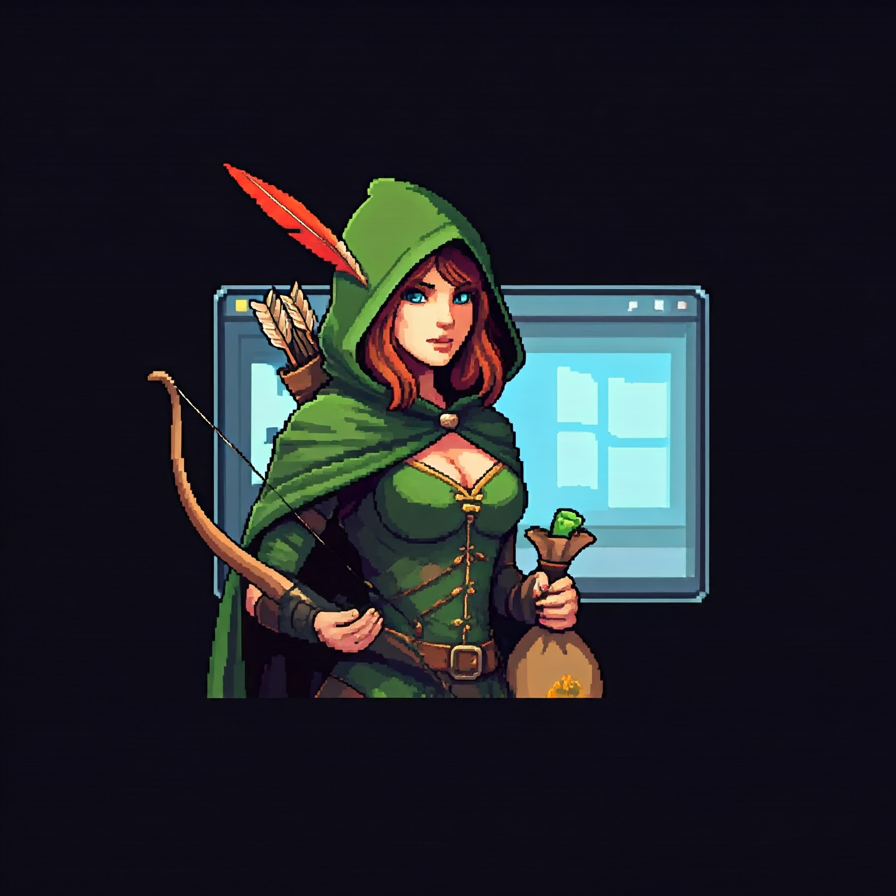

# **Antinum** 
*Turn-based strategy meets relentless combat in a world of evolving challenges.*

## **Overview**

**Antinum** is a gripping turn-based RPG that blends strategic decision-making with intense combat. Players traverse diverse, mysterious locations, each filled with unique trials. In every adventure, you will face 10 consecutive rounds of combat, each against a unique opponent, with careful planning required to conquer your foes. As you progress, you will earn experience points (XP), discover valuable items, and unlock new powers to grow stronger in your journey.

## **Key Features**

- **Strategic Turn-based Combat:** Master the art of tactical gameplay with individual turns in each round of battle. Each move could be the difference between victory and defeat.
  
- **10-Round Combat System:** Each location features 10 rounds of intense battles, with opponents becoming more challenging as you advance.

- **Experience and Progression:** Defeating enemies earns you XP, allowing you to level up and enhance your character's abilities, preparing you for future challenges.

- **Item Discovery:** Scavenge for rare and valuable items that can aid you in combat. From powerful weapons to healing potions, the right items can turn the tide of battle.

- **Diverse Locations:** Explore a variety of environments, each with its own atmosphere and unique set of enemies.

## **Gameplay**

1. **Select a Location** – Begin your journey by choosing from a range of dynamic locations, each harboring new enemies and rewards.

2. **Engage in Combat** – Every location features 10 rounds of combat. Each round is divided into turns, giving you the opportunity to plan and strategize your moves against your opponents.

3. **Gain Experience** – Defeat enemies to earn experience points. With each level up, you grow stronger and unlock new abilities, preparing you for greater threats ahead.

4. **Discover Items** – Along your journey, you’ll find powerful items that can heal you, enhance your stats, or provide an edge in battle.

5. **Overcome Challenges** – Navigate through a variety of enemy types, each requiring unique strategies to overcome. The difficulty increases with each round, testing both your combat prowess and tactical thinking.

## **Why Play Antinum?**

- **Challenging yet Rewarding**: The game's escalating difficulty keeps you on your toes, offering a deep sense of satisfaction with every victory.
  
- **Immersive Combat Experience**: The turn-based combat system allows you to carefully consider each move, making every decision impactful.
  
- **Character Growth**: The leveling and item systems provide a continuous sense of progression, keeping the game exciting and rewarding.

## **Get Involved**

Dive into **Antinum** and prove your strategic prowess! Can you survive the relentless battles and become the ultimate combat master?

---

